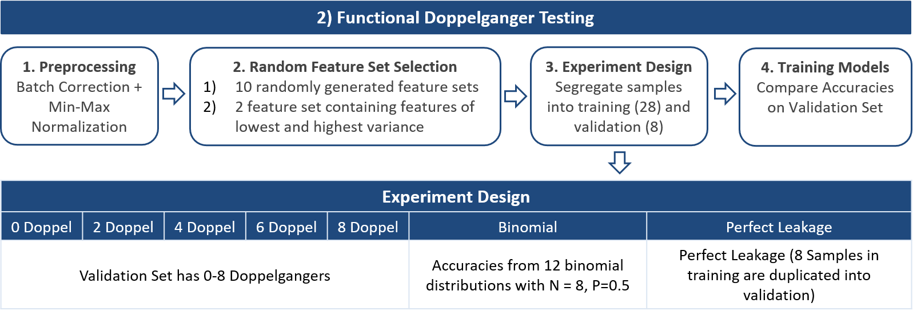

<!-- README.md is generated from README.Rmd. Please edit that file -->

```{r, include = FALSE}
knitr::opts_chunk$set(
  collapse = TRUE,
  comment = "#>",
  fig.path = "man/figures/README-",
  out.width = "100%"
)
```

# doppelgangerIdentifier

<!-- badges: start -->
<!-- badges: end -->

The goal of doppelgangerIdentifier is to find PPCC data doppelgangers that may have an inflationary effect on model accuracy. 

*PPCC*: Pairwise Pearson's Correlation Coefficient, the Pearson's Correlation Coefficient between samples from two different batches. 

## Installation

You can install the development version of doppelgangerIdentifier from [GitHub](https://github.com/) with:

``` r
# install.packages("devtools")
devtools::install_github("lr98769/doppelgangerIdentifier")
```

## Functions

There are 4 main functions in this package: 

### 1. getPPCCDoppelgangers

Finds PPCC data doppelgangers in the data using batch, class and patient id meta data. 

*Note: The effectiveness of getPPCCDoppelganger is affected by the efficacy of the sva::ComBat. Differences in the distribution of classes between batches affects the effectiveness of ComBat and as a result PPCC doppelganger identification.

``` r
library(doppelgangerIdentifier)
ppccDoppelgangerResults = getPPCCDoppelgangers(raw_data, meta_data)
```

### 2. visualisePPCCDoppelgangers

Shows the distribution of PPCCs of different sample pairs. 

``` r
library(doppelgangerIdentifier)
visualisePPCCDoppelgangers(ppccDoppelgangerResults)
```

### 3. doppelgangerVerification

Tests inflationary effects of the PPCC data doppelganger. 

* Note: Refer to the documentation for the format of the experiment plan file. 

``` r
library(doppelgangerIdentifier)
veri_result = doppelgangerVerification(experimentPlanFilename, raw_data, meta_data)
```

### 4. displayVerificationResults

Visualise the accuracy of each Train-Valid Pair.

``` r
library(doppelgangerIdentifier)
displayVerificationResults(veri_result)
```

## Tutorial

In this example, we will be showing how PPCC data doppelgangers can be identified and verified for functionality with the doppelgangerIdentifier r package.

### 0) Importing the doppelgangerIdentifier package

```{r Import & Install Packages}
library("doppelgangerIdentifier")
```

>**Doppelganger effect**: When training and validation data are similar by chance, resulting in an inflation of model accuracies on the validation dataset regardless of how we train the model. 

### 1) Importing Renal Carcinoma (RC) Dataset

To illustrate the impacts of the Doppelganger effect, we will be using a Renal Carcinoma (RC) gene expression dataset. 

```{r Import Dataset, echo=TRUE}
#Import RC gene expression dataset
data(rc)
#Import metadata for RC gene expression dataset
data(rc_metadata)
```

### 2) What Do Functional Doppelgangers Look Like?

> **Functional Doppelgangers**: Sample pairs between training and validation datasets that cause doppelganger effect.

#### Identifying doppelgangers
When functional doppelgangers are found in both training and validation sets, the doppelganger effect is observed. Hence, it is important to identify these doppelgangers and prevent the doppelganger effect from inflating machine learning performance. 

We define possible doppelgangers as samples of the same class (Both samples from Tumor or both samples from Normal) but from different patients. Sample pairs of different class would be used as negative controls while sample pairs of the same class and same patient, indicative of leakage, would be used as positive controls. 

##### Identifying Data Doppelgangers

> **Data Doppelgangers**: Sample pairs of the same class that are highly similar and hence have a high chance of being functional doppelgangers

> **Pairwise Pearson's Correlation Coefficient**: Pearson's Correlation Coefficeint between sample pairs

Since it is computationally tedious to test different subsets of the data that cause the doppelganger effect, we instead identify data doppelgangers, sample pairs that are highly similar and have a high probability of being functional doppelgangers. In our implementation, we utilized Pairwise Pearson's Correlation Coefficient (PPCC) as a metric of similarity and define data doppelgangers identified by this method as PPCC data doppelgangers. 

In section "3) Effects of functional doppelgangers in machine learning", we will demonstrate that the PPCC data doppelgangers identified by this method are functional doppelgangers. 

To show how PPCC data doppelgangers are identified with the RC data set, we treat each batch as a separate data set and try to find PPCC data doppelgangers between the 2 batches. 


**These are the steps we use to identify PPCC data doppelgangers:**
{width=75%}

*PPCC: Pairwise Pearson's Correlation Coefficient*

```{r}
ppccDoppelgangerResults = getPPCCDoppelgangers(rc, rc_metadata)
```
The functions above carry out step 1-5 and output the results into a list containing the following elements:

1. Batch_corrected: Batch corrected data set

```{r}
View(ppccDoppelgangerResults$Batch_corrected)
```

2. PPCC_matrix: Matrix of PPCC between samples of different batch (NumberOfSamplesInBatch1*NumberofSamplesInBatch2)

```{r}
View(ppccDoppelgangerResults$PPCC_matrix)
```

3. PPCC_df: Data frame of PPCC between samples of different batch (NumberOfSamplePairs*5). The columns of the data frame are as follows:
  + Sample1: Name of first sample of the pair (From first batch)
  + Sample2: Name of second sample of the pair (From second batch)
  + PPCC: Pearson's correlation coefficient of this sample pair
  + ClassPatient: Label for the sample pair according to class and patient id similarity
  + DoppelgangerLabel: Labels the sample pair as a PPCC data doppelganger or not

```{r}
View(ppccDoppelgangerResults$PPCC_df)
```

4. cut_off: Cut off PPCC for the identification of PPCC data doppelgangers as sample pairs between the same class and different patient with PPCC greater than cut off point

```{r}
paste("PPCC cut off:", ppccDoppelgangerResults$cut_off)
```

To visualize the PPCC data doppelgangers, we pass the ppccDoppelgangerResults (output list of getPPCCDoppelgangers) to the visualisePPCCDoppelgangers function. 

```{r}
visualisePPCCDoppelgangers(ppccDoppelgangerResults = ppccDoppelgangerResults)
```

### 3) Effects of functional doppelgangers in machine learning
When functional doppelgangers are in both training and validation datasets, an inflation in accuracy on the validation data set regardless of how we train the model would be observed. 

We show that the PPCC data doppelgangers found above cause the doppelganger effect when included in both training and validation sets with the following steps:

{width=75%}

```{r}
functionalityResults = verifyDoppelgangers(
  experimentPlanFilename = "tutorial/experimentPlan.csv",
  raw_data = rc,
  meta_data = rc_metadata)
```
The above functions carry out the experiment plan in experimentPlan.csv and return the results in a list. The following are the elements in the list: 

1. combat_minmax: The gene expression data set after min-max normalization.

```{r}
View(functionalityResults$combat_minmax)
```

2. feature_sets: The 10 randomly generated feature sets and 2 feature set containing features of lowest and highest variance. 

```{r}
View(functionalityResults$feature_sets)
```

3. accuracy_mat: The accuracies of each training_validation and feature set pair in matrix format

```{r}
View(functionalityResults$accuracy_mat)
```

4. accuracy_df: The accuracies of each training_validation and feature set pair in dataframe form

```{r}
View(functionalityResults$accuracy_df)
```

In our current experiment plan, there are 6 training-validation data set pairs:

1. 0 Doppel: 0 Doppelgangers in validation
2. 2 Doppel: 2 Doppelgangers in validation
3. 4 Doppel: 4 Doppelgangers in validation
4. 6 Doppel: 6 Doppelgangers in validation
5. 8 Doppel: 8 Doppelgangers in validation
6. Perfect Leakage: 8 Samples in training are duplicated into validation

The negative control, Binomial, does not require any form of training since it is the accuracy generated by 12 (number of feature sets) binomial distributions with N = 8 (because there are eight samples in the validation set) and P = 0.5 (probability of guessing the correct label for each validation sample).

The increasing number of doppelgangers in validation is used to illustrate the dosage dependent behaviour of doppelgangers.

Here we load in the experiment plan from a comma separated file. The experiment plan specifies the names of samples in each training set and validation set. Care has been taken to prevent any leakage between training and validation sets of 0-8 Doppel. 

To visualize the effect of the PPCC data doppelgangers on validation accuracy, we pass the functionalityResults (output list of doppelgangerFunctionalityVerification) to the displayFunctionalityResults function. 

```{r, fig.width = 10, fig.height = 6}
ori_train_valid_names = c("Doppel_0","Doppel_2", "Doppel_4", "Doppel_6", "Doppel_8", "Neg_Con", "Pos_Con")

new_train_valid_names = c("0 Doppel", "2 Doppel", "4 Doppel", "6 Doppel", "8 Doppel", "Binomial", "Perfect Leakage")

visualiseVerificationResults(functionalityResults, 
                            ori_train_valid_names, 
                            new_train_valid_names)

```

We observe a dosage dependent relationship between the number of doppelgangers and the accuracy of models on the validation set since accuracy increases as the number of doppelgangers in validation set increases. 
